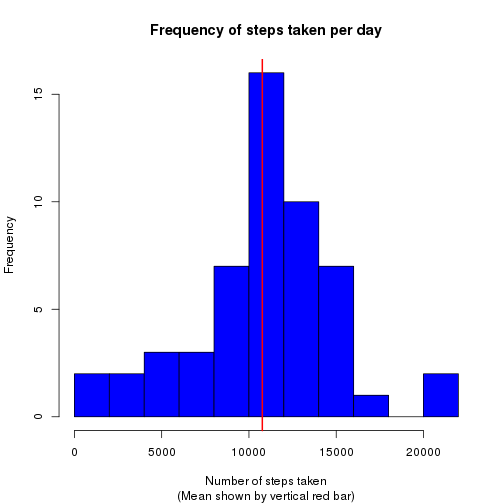
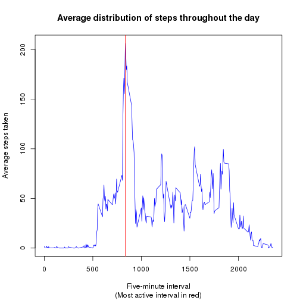
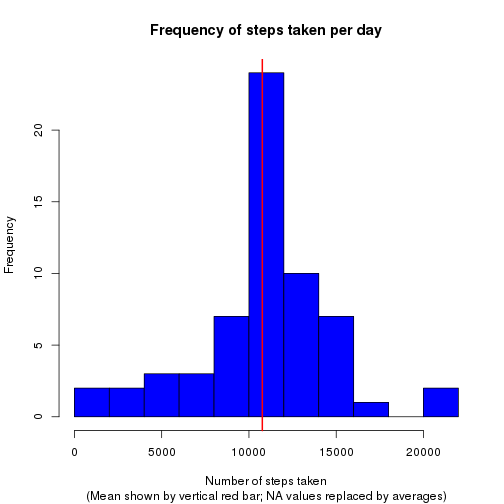
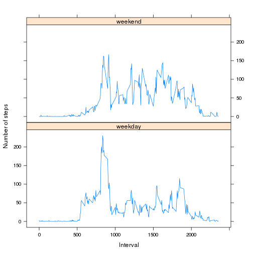

# Reproducible Research: Peer Assessment 1


## Initial configuration
To begin, a few parameters are set to help make the subsequent output look
better. Set options such that numbers with six or more digits before the
decimal point will be printed in scientific notation, and numbers will be
rounded to two decimal places.

To prevent knitr from reformatting the already formatted R code chunks,
the `tidy` option is set to `FALSE`. Finally, the `lattice` plotting package
will be used, and is loaded here.

```r
options(scipen = 1, digits = 2)
opts_chunk$set(tidy = FALSE)
library(lattice)
```


## Loading and preprocessing the data

The data used in this assignment are stored in the CSV file `activity.zip`,
compressed within the archive `activity.zip`.

Extract the data and read them into the R object `data`. At the same time,
create `hour`, `minute`, and `time` lists within the dataset by parsing the
`interval`.

```r
data <- read.csv(unz('activity.zip', 'activity.csv'))
data$hour <- floor(data$interval / 100)
data$minute <- data$interval - 100*data$hour
data$time <- sprintf('%02d:%02d', data$hour, data$minute)
```

For example, the interval `235` now has an associated `hour` of
`floor(235/100) = 2`. Its `minute` is `235 - 100*2 = 35`, and its `time` is
the string `'02:35'`.


## What is mean total number of steps taken per day?

To look at the steps taken per day, instead of per five-minute interval, the
data must be aggregated by day, summing all values with the same `date` value.
Once this has been done, the mean and median steps per day are straightforward
to calculate (with missing values ignored for now).

The mean and median number of steps per day are calculated here as well, to be
used later.

```r
stepsPerDay <- aggregate(steps ~ date, data, sum)
meanStepsPerDay <- mean(stepsPerDay$steps, na.rm = T)
medStepsPerDay <- median(stepsPerDay$steps, na.rm = T)
```


The distribution of the number of steps per day over the two-month period can
be easily visualised with a histogram, on which the mean number of steps can
also be shown.

```r
hist(
  stepsPerDay$steps,
  main = 'Frequency of steps taken per day',
  xlab = 'Number of steps taken',
  breaks = 10,
  col = 'blue',
  sub = '(Mean shown by vertical red bar)'
)
abline(v = meanStepsPerDay, col = 'red', lwd = 2)
```

 

The mean number of steps per day is 10766.19, while the median is
almost the same, at 10765. The difference between these two cannot
be discerned on the graph, which is why only a single line has been added.


## What is the average daily activity pattern?

In this section the data are to be looked at aggregated across all days for
each interval, instead of across all intervals for each day as done above.
The index of the most active interval is found via the `which.max()` function.

```r
meanStepsPerInterval <- aggregate(steps ~ interval, data, mean)
mostActiveInterval <- which.max(meanStepsPerInterval$steps)
```


The most active interval, on average, is number 104 in the
list. This is labelled as 835, and
corresponds to the five-minute period beginning at
08:35.

The average daily activity is easily visualised with the following plot.

```r
plot(
  meanStepsPerInterval$interval,
  meanStepsPerInterval$steps,
  type = 'l',
  main = 'Average distribution of steps throughout the day',
  xlab = 'Five-minute interval',
  ylab = 'Average steps taken',
  col = 'blue',
  sub = '(Most active interval in red)'
)
abline(v = meanStepsPerInterval$interval[mostActiveInterval], col = 'red')
```

 


The vertical red line indicates the location of the most active interval, on
average, which occurs at 08:35.


## Inputing missing values

Several rows are missing the number of steps taken. These can be counted,
and it can be verified that no rows are missing the date or interval,
by summing the results of calling `is.na` on each variable:

```r
num.na.date <- sum(is.na(data$date))
num.na.interval <- sum(is.na(data$interval))
num.na.steps <- sum(is.na(data$steps))
```

The number of rows without step data is `num.na.steps=`2304, and
indeed there are no rows with missing intervals or dates:
`num.na.date=`0 and `num.na.interval=`0.


### Filling in missing values

To eliminate missing values, all rows with `NA` in the `steps` column
will be given the mean number of steps in the same interval, taken over the
days for which that interval is not `NA`. These values are already
stored in the `meanStepsPerInterval` data frame.

First, a new dataset is created. Named `datafull`, it will not have any
missing values after it is processed below.

```r
fulldata <- data
```


Now rows with missing values are identified. The index of the corresponding
interval for each such row is looked up in the `meanStepsPerInterval` object,
and the rows with `NA` values have their `steps` field replaced with that mean.

```r
missing <- is.na(fulldata$steps)    # Isolate the NA values
missing.mean.idx <- match(          # Look up the mean for each interval
  fulldata$interval[missing],       # by matching the missing intervals
  meanStepsPerInterval$interval     # to the intervals in the list of means
)
fulldata$steps[missing] <- meanStepsPerInterval$steps[missing.mean.idx]
```


### Results of data filling

The earlier analysis can now be replicated, without having to remove any `NA`
values. As above, the data are aggregated, and the mean and median per day
are calculated.

```r
fullStepsPerDay <- aggregate(steps ~ date, fulldata, sum)
fullMeanStepsPerDay <- mean(fullStepsPerDay$steps)  # Note: no na.rm = T
fullMedStepsPerDay <- median(fullStepsPerDay$steps) # Note: no na.rm = T
```

The mean and median number of steps per day on the filled-in dataset are
10766.19 and 10766.19, respectively.
The mean number has not changed (`meanStepsPerDay=`10766.19),
however the median is slightly different
(compare to `medStepsPerDay=`10765).
This is because non-integer numbers of steps have been added to the dataset.

Very little has changed visually, except for the fact that there are now a
greater number of steps &lsquo;taken&rsquo; in total.

```r
hist(
  fullStepsPerDay$steps,
  main = 'Frequency of steps taken per day',
  xlab = 'Number of steps taken',
  breaks = 10,
  col = 'blue',
  sub = '(Mean shown by vertical red bar; NA values replaced by averages)'
)
abline(v = fullMeanStepsPerDay, col = 'red', lwd = 2)
```

 


## Are there differences in activity patterns between weekdays and weekends?

The `weekdays()` command returns the day of the week for a given date. To use 
it, the date strings in `data$date` must first be converted to `Date`-class
objects with the `as.Date()` function. The results `'Saturday'` and `'Sunday'`
can then be converted to `'weekend'`, and all other values to `'weekday'`.

```r
fulldata$day.type <- as.factor(ifelse(
  weekdays(as.Date(data$date)) %in% c('Saturday', 'Sunday'),
  'weekend',
  'weekday'
))
```


Breaking down the aggregation of the mean number of steps by both the
`interval` and `day.type` fields yields a three-column data frame, with the
number of steps taken during each interval averaged once over all weekdays,
and once over the weekends.

```r
meanStepsPerIntervalDayTypes <- aggregate(
  steps ~ interval + day.type,
  fulldata,
  FUN = mean
)
```


The steps can now be easily plotted as a function of the time interval, broken
into a separate plot for each of the two types of day.

```r
xyplot(
  steps ~ interval | day.type,
  data = meanStepsPerIntervalDayTypes,
  type = 'l', # Make a line plot
  layout = c(1, 2),
  ylab = 'Number of steps',
  xlab = 'Interval'
)
```

 


Visually speaking, there are still several peaks and valleys as the number
of steps taken fluctuates throughout the day, with a global maximum early in
the day. However, this maximum is less extreme on the weekends, and the steps
are more consistently taken throughout the day. It can also be seen that the
number of steps did not start to increase as early in the day on weekends as
it did on weekdays, presumably a sign of the subject's having slept later.
